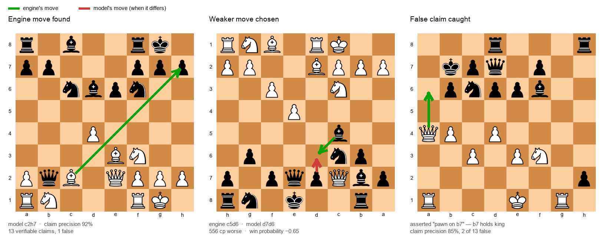
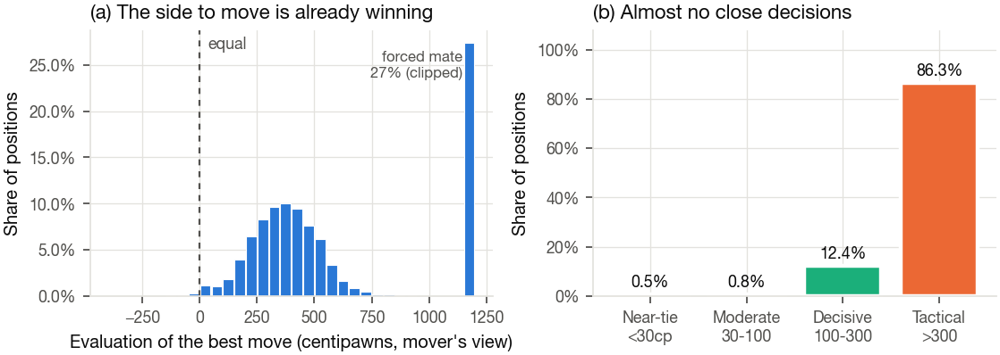

# Grounded LLM Reasoning in Chess through Claim-Verified Group Relative Policy Optimization

Reinforcement learning for chess reasoning where the reward scores **the claims inside the
reasoning**, not only the final move.

A language model that explains a chess move makes checkable assertions — *"the knight on f6
is pinned"*, *"h7 is defended only by the king"*, *"Rxe5 loses a piece"*. Each of these is a
function call away from a verdict. This repository treats those assertions as a training
signal: every claim in a generated trace is verified against the position with
`python-chess` and a precomputed engine table, and the verification result enters the GRPO
reward alongside move quality.

---

## Contents

- [Why claim verification](#why-claim-verification)
- [Method](#method)
- [The verifier](#the-verifier)
- [Reward](#reward)
- [Dataset](#dataset)
- [Evaluation](#evaluation)
- [Installation](#installation)
- [Usage](#usage)
- [Repository layout](#repository-layout)
- [Reproducibility](#reproducibility)

---

## Why claim verification

The standard recipe for synthetic reasoning data shows a teacher model the answer and asks
it to explain. The explanations are fluent, and frequently false.

Measured on 3,000 traces produced that way over positions from this corpus:

| Check | Claims | False | Rate |
|---|---:|---:|---:|
| Piece-on-square assertions | 7,596 | 633 | **8.3%** |
| Traces with at least one false assertion | 3,000 | 585 | **19.5%** |

The failure is visible in the generators' own reasoning. Across 10,296 traces, **100%**
contain at least one self-correction marker (mean 18.5 per trace) and **96.3%** explicitly
re-derive the board mid-thought. A representative case — the black king stands on **h7**,
and the model writes:

> "Rank 7: `2Q1bRpk` → Q on c7, b on e7, R on f7, p on h7, k on **h8**."

Wrong twice in one line. The model then reasons about a mating net around a king that is
not there, and still emits the correct move, because the correct move was supplied in its
prompt.

Outcome-only rewards cannot see this. A trace that reaches the right move for fabricated
reasons scores identically to one that reaches it correctly.

### What the verifier sees



Real model output, selected by the verifier rather than by hand. Green is the engine's
preferred move; red is the model's, drawn only where the two differ.

The right-hand panel is the case that motivates the method. The model asserts a **pawn on
b7** — the square holds the black **king** — and the verifier marks 2 of 13 claims false.
An outcome-only reward has no way to express that; a claim-level reward scores it directly.

Regenerate from any records file:

```bash
python scripts/10_board_figures.py \
  --records runs/eval/<system>.jsonl \
  --tables-glob 'data/final/tables/*.jsonl'
```

---

## Method

### Trace format

Generation produces a contrastive, structured trace. The candidate list is the important
part: a model trained only on justifications of a single move has no basis for
discriminating between moves, which is the task at inference.

```
<read>
Black's queen on b2 is exposed. White's bishop on c2 has a clear diagonal to h7.
</read>
<candidates>
1. c2h7 | f6h7 e2b2 | wins the queen after the recapture
2. d4d5 | b2a1 d5c6 | opens the c-file but allows counterplay
3. f1c1 | b2c1 | loses the exchange
</candidates>
<choice>
c2h7 is decisive because the recapture leaves the queen on b2 undefended.
</choice>
<move>c2h7</move>
```

The teacher sees the engine's move table and principal variations; **the student prompt
contains the position only** — no answer, no engine data. Continuations are copied from
real principal variations rather than invented, which removes the largest source of
false claims (illegal replies).

### Pipeline

| Stage | Input | Output |
|---|---|---|
| Engine tables | positions | score for every legal move + PVs for the top 8 |
| Generation | position + engine table | contrastive trace |
| Verification | trace + position | per-claim verdicts, accept/reject |
| SFT | accepted traces | policy initialised on verified reasoning |
| GRPO | positions + reward | policy optimised against claim-level reward |

Every RL arm starts from identical merged SFT weights and applies its own LoRA, so arms
differ only by reward composition.

---

## The verifier

Deterministic, CPU-only, no model in the loop. Claim extraction is a regular grammar;
checking is `python-chess` plus a cached engine table.

| # | Claim type | Check | Needs engine |
|---|---|---|:---:|
| 1 | Piece occupies square | `board.piece_at()` | |
| 2 | Move is legal | `board.legal_moves` | |
| 3 | Move captures / gives check | `is_capture()`, `gives_check()` | |
| 4 | Square attacked / defended | `board.attackers()` | |
| 5 | Piece is pinned | `board.is_pinned()` | |
| 6 | Material balance after a line | push line, count | |
| 7 | Piece mobility | legal moves from square | |
| 8 | Pawn structure | pawn bitboards | |
| 9 | Line is forced | cached table | ● |
| 10 | Evaluation after a line | cached table | ● |
| 11 | Move loses material | cached table | ● |
| 12 | Vague strategic claim | counted, never scored | |

Types 1–8 need only the board, which is what makes verification usable at inference time
with no engine and no ground truth.

Three properties the implementation commits to:

**Conservative extraction.** A pattern that could plausibly match a non-claim is excluded.
Moves written in prose are usually moves *inside a variation* — "if White defends with
Re1, Black plays Qxe1" — and scoring those against the root position penalises correct
analysis. Measured on this corpus, 221 of 255 apparent illegal-move violations were of
exactly that kind. Moves are therefore root-scored only inside `<candidates>` heads and
the `<move>` tag; continuations are checked by **replay**.

**Notation is normalised, not punished.** Models mix UCI, SAN, long algebraic and bare
destination squares. `resolve_move()` normalises all of them against the board and drops
what cannot resolve, rather than passing a phantom move downstream.

**An explicit unverifiable class.** Vague prose is counted but never scored, so the reward
neither rewards nor penalises it as though it were false.

---

## Reward

```
R = w₁·R_move + w₂·R_precision + w₃·R_coverage + w₄·R_format
    − penalties (illegal move, false occupancy claim)
```

**`R_move` — win probability, not centipawns.** Centipawn loss is badly non-linear: 50 cp
is decisive at equality and irrelevant at +900.

```python
def wp(cp):
    return 1 / (1 + 10 ** (-cp / 400))

R_move = 1 - clip((wp(cp_best) - wp(cp_played)) / TOL, 0, 1)   # TOL = 0.10
```

**`R_precision`** — verified claims over scorable claims.

**`R_coverage`** — required, not optional. A policy maximising precision alone learns to
assert one trivially-true fact and stop. Coverage counts only *true* claims, so it cannot
be farmed by asserting more.

Reward composition is set entirely in configuration, so comparison arms differ by YAML and
not by code:

| Arm | Terms | Isolates |
|---|---|---|
| **M6** | move + precision + coverage + format + penalty | full method |
| **M3** | move + format + penalty | dense move reward alone |
| **M4** | sparse binary + format + penalty | outcome-only RLVR |
| **A3** | move + precision + format + penalty | precision without coverage |

---

## Dataset

Positions derive from the MATE corpus (Wang et al., NAACL 2025). Engine analysis is
Stockfish 17.1 at a fixed **400,000-node** limit — a node limit rather than a time limit,
so the tables are reproducible across machines.

| Artifact | Size |
|---|---:|
| Positions with a complete legal-move table | 149,982 |
| Generated traces | 149,982 |
| **Traces passing verification** | **54,915 (36.6%)** |
| RL positions (band-stratified) | 16,231 |
| Held-out evaluation items | 5,256 |

### Rejection breakdown

What an answer-conditioned teacher gets wrong even with the position, the answer, and the
true principal variation all in front of it:

| Reason | Count |
|---|---:|
| Claim precision below threshold | 81,523 |
| False occupancy claim | 72,520 |
| Illegal move reference | 13,859 |
| Fewer than three candidates | 12,601 |
| No move produced | 9,196 |
| Move quality outside tolerance | 9,183 |

### Distribution

The source corpus is **not representative chess**, and results must be read per decision
band rather than pooled. Over 15,000 sampled positions:

| Property | Value |
|---|---:|
| Side to move already winning | 99.2% |
| Median evaluation of the best move | +438 cp |
| Best line is a forced mate | 27.4% |
| Positions with a near-tie decision (<30 cp) | 0.5% |



The corpus is a tactics set: 86.3% of positions have a decisive gap above 300 cp. Pooled
accuracy on this distribution overstates ability, which is why every metric in this
repository is reported by band.

### Data integrity

Verified over the full corpus:

- No game-level leakage — 149,897 distinct pawn skeletons across 149,982 positions, with
  0.1% sharing one. A position-level train/test split is therefore sound, which is not
  usually true of chess corpora built from consecutive plies.
- Zero invalid FENs and zero illegal reference moves in a 20,000-position sample.
- Side to move balanced at 50.7% / 49.3%.

---

## Evaluation

Generation happens once; every metric is recomputed from saved records. Each record holds
all sampled completions, decode settings, gold data and the engine-table slice, so a new
metric or a different `n` for best-of-`n` costs no GPU time.

Variants are generated in the same pass, because each needs its own forward pass:

| Variant | Question |
|---|---|
| `base` | accuracy, grounding, reranking |
| `perturbed` | is the reasoning causally used, or decoration? |
| `no_reasoning` | what does the reasoning actually buy? |
| `constrained` | is the legality gain real, or free from logit masking? |

### Benchmarks

| Benchmark | Items | Stratification |
|---|---:|---|
| Held-out split | 3,615 | 4 decision bands |
| Lichess puzzles | 1,141 | 5 rating bands, 20 themes |
| ChessQA | 500 | 5 categories |

All systems are scored on a **frozen item file**, so identical items are guaranteed by
construction rather than by reproducing a sampling seed.

### Metrics

Move quality (top-1, top-3, win-probability loss, illegal rate), grounding (claim precision
overall and per type, coverage, hard violations), faithfulness (perturbation sensitivity,
reasoning necessity), efficiency (tokens per solution), and verified reranking gain — each
available grouped by band, rating bucket, theme or benchmark, with bootstrap confidence
intervals, paired bootstrap tests and Holm–Bonferroni correction.

Playing strength is measured separately by full games against Stockfish, reporting Elo with
intervals, blunder rate per 100 moves, and average centipawn loss.

---

## Installation

```bash
pip install -e ".[train,dev]"
pytest -q
```

Training and batched inference require a CUDA device. The verifier, the engine tables and
all metrics are CPU-only.

## Usage

### Verify a trace

```python
from chessr.claims import verify_structured_trace

report = verify_structured_trace(fen, trace_text, engine_table)
report.precision          # verified / scorable
report.violations()       # claims that are false, with reasons
report.has_hard_violation # a false piece claim or an illegal move
```

### Score a completion

```python
from chessr.reward import score_completion

b = score_completion(fen, completion, engine_table)
b.move, b.precision, b.coverage, b.penalty, b.total
```

### Pipeline

```bash
make tables            # Stockfish tables over all legal moves
make generate          # teacher traces
make filter            # acceptance gates and rejection breakdown
make sft
python scripts/05_grpo.py --config configs/grpo_m6.yaml
make eval
```

Modal entry points mirror each stage for cloud execution:

```bash
modal run modal_app.py::engine_tables
modal run modal_app.py::generate_all
modal run modal_app.py::prepare_eval
modal run modal_app.py::eval_sweep
```

---

## Repository layout

```
src/chessr/
  claims.py      claim extraction and verification — 12 types, deterministic
  reward.py      reward components and TRL-compatible reward functions
  engine.py      Stockfish pools, legal-move tables with principal variations
  prompts.py     teacher and student prompts, structured-trace parser
  boards.py      FEN utilities and the win-probability scale
  benchmarks.py  Lichess, ChessQA, MATE and held-out loaders
  evalsuite.py   evaluation harness — generate once, save everything
  metrics.py     every metric, computed from saved records
  play.py        full games against Stockfish, Elo and blunder rate
  rerank.py      verified reranking — engine-free, usable at inference
  boardviz.py    board figures with engine and model moves
  plots.py       publication figures
configs/         one YAML per experimental arm
scripts/         numbered pipeline stages
modal_app.py     cloud execution
tests/           76 tests over hand-checked positions
```

---

## Reproducibility

- **Engine determinism** — node limits, not time limits; Stockfish version pinned.
- **Frozen evaluation set** — item selection written to a file, not resampled per run.
- **Raw records released** — every completion, decode setting and engine slice, so any
  published number can be recomputed and any new metric added without re-running a model.
- **Matched comparison** — all arms share one base checkpoint and differ only in reward.
- **Verifier regression test** — `make audit` recomputes the corpus claim statistics and
  fails if they drift from the published values.

Datasets, engine tables, model checkpoints and evaluation records:
[`GOVINDFROM/chess-process-verified`](https://huggingface.co/datasets/GOVINDFROM/chess-process-verified)

## License

Code released under the MIT License. The MATE corpus and Lichess data retain their
original licenses.
